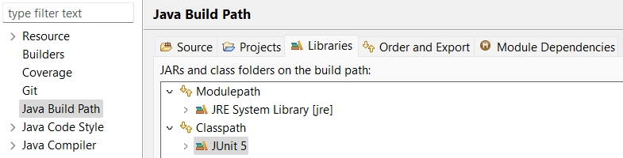
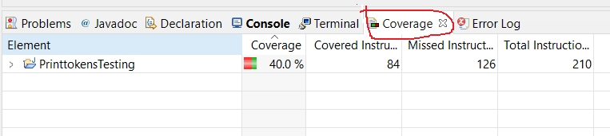
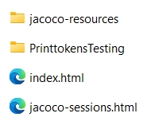

### PureNameCheck

*PureNameCheck* is created as an example to show how to write JUnit test methods.

**Class** *PureNameCheck* contains:

- A **main** method and 
- Two **regular** methods: 
  + *checkPureName* 
  + *getNameFromSystemIn*

**Two test classes**: 
- *TestMain*: for end-to-end testing containing two test methods via testing the **main** method.

- *TestRegularMethods*: for unit testing containing the test methods that test the  **regular** methods (non-main methods).

### Set up with Eclipse IDE
1,  Launch Eclipse IDE
2,  Import as a project via
  - File -> Open Projects From File System.
  - Click 'directory' to choose the root directory of the project files.
  - Click 'finish'.

3, Configure JUnit 5 

 - Right-click your project, select **Build Path** > **Configure Build Path**.
 - Go to the **Libraries** tab, click **Classpath** and then **Add Library**.
 - select **JUnit** and click "Next".
 - Select **JUnit 5** from the dropdown.
 - Click "Finish" and then "Apply and Close".
 - Java Build Path with JUnit 5 added:

   

 
 

### Execute a test file and generate a coverage report
1, Run a **test file** by right-clicking the file and selecting **Coverage as** -> **Junit Test**.

2, The **Coverage view** appears automatically along with the **Terminal** or **Console**. An example is shown below:

 
3, Generate an HTML Coverage Report by **right-clicking** some space in the Coverage view, **selecting** "Export Session", **choosing** "HTML format" and directory to save the report, and **clicking** "Finish" button.

An **complete example of an HTML Coverage Report** are shown below:

  

### Generate two HTML coverage reports

- End-to-end testing: put all the tests of the main method in one test file (eg. TestMain.java) and generate by executing this file.
- Unit testing: put all the tests of the non-main methods in another test file (eg. TestRegularMethods.java)  and generate by executing this file.
