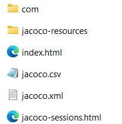
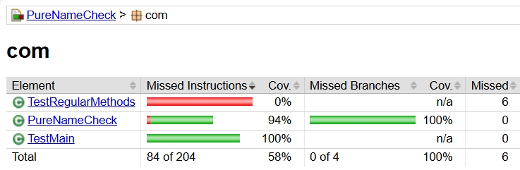

### Program under the Test

*PureNameCheck* is created as an example to show how to write JUnit test methods.

**Class** *PureNameCheck* contains:

- A **main** method and 
- Two **non-main** methods: 
  + *checkPureName* 
  + *getNameFromSystemIn*

**Two test classes**: 
- *TestMain*: for end-to-end testing containing two test methods via testing the **main** method.

- *TestOtherMethods*: for unit testing containing the test methods that test **non-main** methods.


<hr>

### Set up with VS Code
1, Launch VS Code

2, Install "Extension Pack for Java" via "Extensions" icon.

3, Import as a project
  - File -> Open Folder....
  - Select the root directiry of the project.
  - Click 'Select Folder'.

<hr>

### Check Code Coverage
When checking code coverage, to ensure accurate results and avoid issues from previous builds, we need to clean to remove old build artifacts and get a fresh measurement.

So, to get the code coverage for a single test file named "testFileName", we use the following commands:

```bash
mvn clean 
mvn -Dtest=testFileName test
mvn jacoco:report
```


### Generate two HTML Coverage Reports

The coverage report should show the code coverage of the **program under the test** and the **tests** themselves. This enables us to analyze test contributions to coverage, helping us differentiate between end-to-end and unit testing.

Note that it is optional to follow the instructions below to generate reports. But for the coverage reports only containing the coverage of the program under the test, project demo is necessary.

- Configure the **pom.xml** file. Change the value of the "scope" tag from "test" to "main" in the dependency blocks of "org.junit.jupiter".

- Organize the test files
  + End-to-end testing. Put all the tests of the main method in one test file (eg. the TestMain.java).
  + Unit testing. Put all the tests of the non-main methods in another test file (eg. the TestOtherMethods.java).
  + Copy these two test files where the program under the test is.
  
- Execute test files
  + For end-to-end testing
    * Only keep the test file for the end-to-end testing in "./src/test/java/com/".
    * Remove all the other test files.
    * Execute "mvn clean verify" in the terminal

  + For unit testing, apply the same way as the end-to-end testing.

- Check code coverage 
  + A coverage report consists of all the files and folders in the "./target/site/jacoco/". An example is shown below:

    

  + Open the "index.html" to view code coverage. The coverage for end-to-end testing in this branch is given below:
  
  The code coverage achieved here is 94%. Only the tests in the TestMain.java are executed to achieve this coverage. Hence this is the coverage report for the end-to-end testing. 


